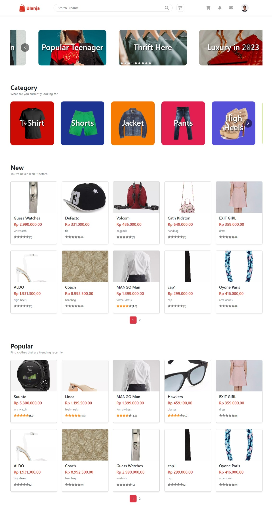
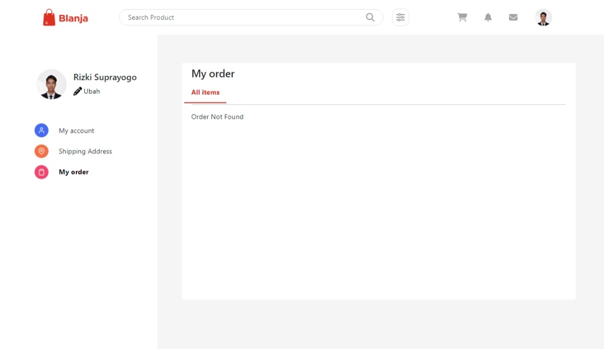

<h3 align="center">Blanja</h3>
<p align="center">
  <a href="https://blanja-fe-sigma.vercel.app/">View Demo</a>
</p>

## Project Description 🚀

"Blanja" is a project portfolio that I have collaborated on as part of a project team. This platform is an e-commerce website that specifically focuses on fashion products. With a user-friendly interface and a wide range of fashion items, "Blanja" provides users with a convenient and engaging online shopping experience.

## Technologies Used 💻🛠️

The Blanja project is built using the following technologies:

- HTML
- CSS
- JavaScript
- Bootstrap
- JQuery
- Redux (State management)
- SASS (Syntactically Awesome Style Sheets)
- React (Frontend framework)
- Sweet Alert (Alert library)
- Skeleton (Responsive CSS framework)
- Node.Js (JavaScript runtime)
- Axios (HTTP client)


## Features ✨🛍️👕👖

- User-friendly e-commerce website with a focus on fashion products
- Browse and search for fashion items
- Add products to the shopping cart
- Place orders and make payments
- User authentication and account management
- State management with Redux for improved performance
- Responsive design using Bootstrap and Skeleton
- Interactive alerts with Sweet Alert
- Asynchronous data handling with Axios

 
<!-- GETTING STARTED -->
## Getting Started

### Installation
- Clone This Repository

`https://github.com/suprayogo/blanja-fe.git`

- Install Module

`npm install`

- Setting .env

```bash
 [ Api Deploy ] : https://rich-teal-camel-tutu.cyclic.app
```

### Executing program

- Run this project with `npm run dev`.


## Screenshots 📸

## Tabel Screenshot

| Home Page      | Detail Page    |
|--------------- |---------------|
|  |  |

| Login Page     | Register Page  |
|--------------- |---------------|
|  |  |

| Checkout Page  | Profile Page   |
|--------------- |---------------|
|  |  |

| Order Page     | Address Page   |
|--------------- |---------------|
|  |  |


## Related Project

- [Blanja BE ](https://github.com/suprayogo/blanja-be)
- [Blanja Demo](https://blanja-fe-sigma.vercel.app/)

## Authors

Contributors names and contact info project team in blanja front-end:

1. Isnan Arif Cahyadi

- [Linkedin](https://www.linkedin.com/in/isnanarifcahyadi/)

2. Rizki Suprayogo

- [Linkedin](https://www.linkedin.com/in/rizki-suprayogo/)

3. Irham Nofrianda

- [Linkedin](https://www.linkedin.com/in/irhamnfrnda/)
